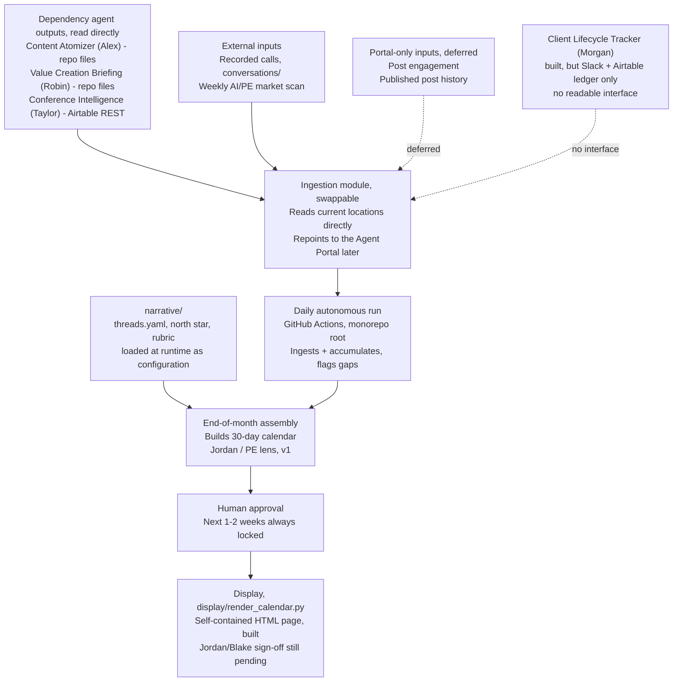

# C2 Workflow Mapping

Per Jordan's direction on the founder interview call, this maps out how data actually flows through the agent. See PRD.md for full detail. Updated 2026-08-18 after verifying the dependency agents' current output locations against `origin/main`.

Notes on reading this:

The ingestion module is deliberately isolated from the rest of the agent. It reads each dependency agent's current output location directly: local repo files for Alex and Robin, the Airtable REST API for Taylor, and local files for this folder's `conversations/`. Only this module changes when the sources move, and the calendar synthesis logic underneath it does not.

The dotted edges are the two things that changed on 2026-08-18. QofAI's central Agent Portal is now built and live, and it holds two inputs that exist nowhere else. Post engagement moved out of Maria's own Airtable into the portal's central LinkedIn store, and published post history is created by a manual human posting step, so neither has a repo-file path. C2 stays on direct reads until Content Atomizer and Value Creation Briefing publish to the portal too, rather than maintaining two ingestion paths at once. The consequence is that the rubric scores a window on internal coherence alone in v1, with no engagement weighting and no trailing-post continuity. PRD.md Section 3 records the decision and the trigger to revisit it.

Morgan's Client Lifecycle Tracker is built and running, but its outputs are a Slack digest and an Airtable ledger, so there is no interface C2 can read on either path. That is a conversation with Morgan, not a wait for his build.

The narrative layer feeds the assembly step rather than the ingestion step. `threads.yaml` is loaded at runtime because editorial strategy is configuration, not logic. Changing what the calendar argues should mean editing that file, never touching Python.

The agent runs autonomously, once a day, with no dependency on a person being present or approving anything for it to operate. Its workflow lives at the monorepo root `.github/workflows/`, because GitHub Actions requires that path. It ingests and stores whatever new input showed up that day. At an end-of-month point (exact date still to be set with Jordan), it assembles everything accumulated that month into the actual forward calendar.

Human approval sits between the calendar being assembled and anything actually going out, and this gate is separate from the autonomous daily run. The portal already implements this loop, so at onboarding the portal's queue should be evaluated as a replacement rather than run alongside a second one.

The display layer is a simple custom-built HTML page rather than an existing subscription product (Jordan mentioned one, referred to as Tapleo or Tablio), per Pat's steer. `display/render_calendar.py` builds it, reading a window through the calendar data model and writing one file that opens from disk. The choice is still not finalized until Jordan and Blake weigh in, and the page exists so that decision is about something they can look at.

v1 scope stops at a single calendar for Jordan's private-equity lens. The Casy (operator) and Blake (technical) lenses are the same pipeline run again later, not part of this version.
