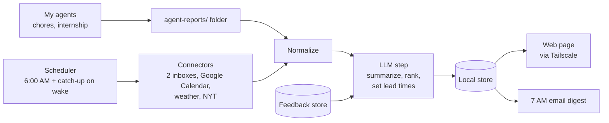

# Life Dashboard — PRD

Sep 24, 2026

## Overview

Life Dashboard is one morning page that replaces opening 6+ apps: news, AI brief, weather, two inboxes, Google Calendar, job search, chores, a dedicated QofAI section, and a short list of things that need action today. It is built as a local agent on my own machine that gathers each source at 6:00 AM, summarizes it with an LLM, and renders a single brief I read in under 5 minutes.

**Problem.** Every morning I check the NYT, an AI daily brief, weather, my inbox, job-search updates and chore reminders separately. Each app has its own noise, and the important items (a recruiter reply, a chore due tonight, a deadline) get buried. The cost is time and missed actions, not lack of information.

## Goals and success metrics

**Goals**

- One place to start the day: every source I check each morning appears in a single view.
- Surface what needs action, not just what happened: a ranked "Pressing actions" list at the top.
- Fast: the brief is ready when I wake up and readable in under 5 minutes.
- Extensible: adding a new source means writing one connector, not changing the whole app.

**Non-goals (v1)**

- Taking actions (sending replies, scheduling). v1 is read-only; actions come later, each with my approval.
- Brokerage balances or trading. My Robinhood is long-term savings, and checking it daily would be unhealthy, so it stays off. The trading agent can be added once it exists.
- A native mobile app; a phone-friendly page plus an email digest is enough.
- Multi-user support; this is for me only.

**Success metrics**

| Metric | Target |
| --- | --- |
| Brief ready before wake-up | 7:00 AM, 95% of days |
| Time to read the full brief | Under 5 minutes |
| Apps opened before 9 AM | Down from ~6 to 1–2 |
| Missed chores or replies per week | 0 |
| Days used per week, after 1 month | 5+ |

## User and morning routine

The only user is me: a UChicago student who also builds AI agents at QofAI and lives in Chicago with two roommates. My mornings mix class, work and an active job search, so the brief has to cover school, work and home in one pass.

**Today's routine (what the dashboard replaces)**

1. Read the NYT.
2. Read the AI Daily Brief website.
3. Check weather for the walk to campus.
4. Scan my inboxes: personal Gmail and UChicago. QofAI communication happens in Slack.
5. Check Google Calendar (personal, school and QofAI, plus Canvas due dates).
6. Check job-search status from my internship agent (Airtable).
7. Check chores — my chore agent emails me what's due.

**Target routine:** the brief is ready before 7:00 AM; I open one page on my phone or laptop, read Pressing actions first, then skim the rest. Same brief seven days a week, weekends included.

## Modules

Each module is a card on the page, fed by one connector, and summarized to a few lines. Pressing actions sits at the top because it pulls from every personal module; QofAI stays in its own section.

| Module | What it shows | Priority |
| --- | --- | --- |
| Pressing actions | 3–7 ranked items needing action today, each linked to its source and saying why it made the list | P0 |
| Calendar | Today's events from Google Calendar (personal, UChicago, QofAI, Canvas due dates), plus upcoming items surfaced early based on importance | P0 |
| Email | Across personal Gmail and UChicago: only pressing, time-sensitive school, work and internship email (a reply or action needed soon), 1 line each with why and any deadline, labeled by inbox; everything else collapsed | P0 |
| QofAI | Everything work-related in one dedicated section: today's QofAI meetings and work deadlines. QofAI email is not read (its communication happens in Slack). Kept out of Pressing actions. | P0 |
| Chores | My chores due today and overdue, from the chore agent | P0 |
| Weather | Now, high/low, rain chance, and a one-line "what to wear for the walk" for Chicago | P0 |
| Job search | Changes from my internship agent's report email: new applications, status changes, interviews, deadlines, recruiter replies | P1 |
| News | NYT top stories weighted to tech, business and AI; hard cap of 5 items, 2 lines each | P1 |
| AI Daily Brief | 3–5 key items from the AI Daily Brief website, deduplicated against News | P1 |
| Yesterday recap | What I planned vs. what got done (from actions I checked off) | P2 |

**Email triage.** An LLM reads sender, subject and snippet for each Primary-tab thread where I didn't send the last message, and keeps only pressing school, work and internship email. If the LLM call fails, simple rules (a real person wrote last) stand in and the card says so. This part of the LLM step lands in M3, ahead of the rest of M5.

**Pressing actions logic.** An LLM ranks candidates from every personal module (QofAI has its own section) by deadline, who is waiting on me, and cost of missing it.

**Importance-based lead time.** An LLM call rates each upcoming event and decides how early it appears: e.g. exams and interviews about a week ahead (as prep reminders), assignments a few days ahead, birthdays a day ahead.

**Feedback loop.** Every surfaced item has "too early / too late / not needed" buttons. Feedback is stored and fed back into the ranking and lead-time prompts, so timing adapts to me over time.

## Data sources and integrations

Two inboxes, one calendar, three web sources, and my own agents cover everything. The chore agent writes a report file; the internship agent is read from the email it already sends me.

| Module | Source | Access method | Open question |
| --- | --- | --- | --- |
| Email | Personal Gmail, UChicago (Google) | Gmail API, read-only OAuth, one connection per inbox | Does UChicago allow third-party Gmail access (policy and admin settings)? |
| Calendar | Google Calendar (personal + subscribed UChicago, QofAI and Canvas feeds) | Google Calendar API, read-only | Subscribed feeds sync every several hours, so same-day changes may lag |
| Chores | Chore agent | Agent writes a report file to the shared folder; its email stays as backup | — |
| Job search | Internship agent's report email | Parse the email from my inbox by sender and subject | Is the email format stable? (check the agent's code in Claude Code) |
| Weather | Chicago | Free weather API (e.g. Open-Meteo, NWS) | — |
| News | NYT | NYT Top Stories API (technology, business + home sections) | API key |
| AI Daily Brief | AI Daily Brief website | No RSS, but the site's agent feed (aidailybrief.ai/agent.json) lists each edition with title, teaser, tags, and markdown/JSON links; also try /e/<today>.json, since the feed can lag the homepage by a day | — |

**Agent report contract.** Each personal agent writes `agent-reports/<agent>.json` with `generated_at`, `status`, and `items[]` (title, summary, due date, urgency, link). Any future agent (e.g. the trading agent) plugs in by writing the same file.

**Connector rule:** every connector returns the same item shape, so the summarizer and page stay source-agnostic.

## Interface and UX

A single scrolling web page, served locally, that reads well on a laptop and a phone. The layout puts decisions first and reading material last.

1. **Header:** date, greeting, weather one-liner, today's first calendar event.
2. **Pressing actions:** ranked checklist with source links.
3. **Today:** calendar and chores side by side.
4. **Inbox:** pressing school, work and internship email, then a collapsed "everything else" section.
5. **QofAI:** today's work meetings and deadlines, kept separate from personal items.
6. **Job search:** changes since yesterday.
7. **Reading:** NYT and AI brief cards, each 3–5 items.

**Interaction (v1):** check off actions, expand a card, click through to the source, and a "refresh now" button. Each card shows when it last updated, and a failed connector shows an error state instead of breaking the page.

**Delivery:** I read it on my phone or laptop depending on the day. The live page is the main view; a 7:00 AM email digest of the same brief guarantees it reaches my phone even if the page isn't reachable.

## Architecture

A scheduled agent on my laptop runs at 6:00 AM, reads my agents' report files and each external source, has an LLM summarize and rank, saves the result, and serves it as a page plus an email digest. Built with Claude Code.

External sources and agent reports merge into one item list; one LLM pass, informed by past feedback, produces the brief.

**Key choices**

- **Hosting (v1):** my laptop, since my agents already live there. Schedule it to wake at 6:00 AM (`pmset` on a Mac) and re-run on wake if a run was missed. Phone access via the email digest from day one, then Tailscale for private access to the live page.
- **Hosting (later):** move to a ~$5/month always-on cloud server if missed mornings become common; agents would then push their reports to it.
- **Stack:** Python for connectors and the agent; a lightweight, phone-friendly web page.
- **LLM:** Claude API for summarization, ranking and lead-time decisions; prompts stored in the repo.
- **Config in repo:** inboxes, news sections, location, and importance rules live in one config file.
- **Caching:** each connector keeps its last good result so one failure doesn't blank the page.
- **Repo scaffold:** my usual setup (README.md, CHANGELOG.md, CLAUDE.md, PRD.md); this doc becomes PRD.md.

## Privacy and security

The dashboard touches my inbox, so it stays read-only and local by default.

- Read-only OAuth scopes for both inboxes and Google Calendar in v1; no send, delete or edit permissions until the actions phase.
- **QofAI:** its email is not read. Work items from Calendar stay labeled so they're easy to exclude.
- **UChicago account:** check university policy before granting third-party API access.
- API keys and tokens in a `.env` file excluded from git; never in the public repo.
- Phone access only through Tailscale (private network) or the email digest; the page is never on the open internet.
- Send the LLM only what it needs (sender, subject, snippet, event title and time), not full email bodies by default.
- Treat email, newsletter and calendar text as data: the LLM step must not follow instructions found inside them.

## MVP scope and milestones

The MVP is weather, email, chores, Google Calendar and Pressing actions on one page, refreshed every morning. Everything else is added one connector at a time.

| Milestone | Scope | Done when |
| --- | --- | --- |
| M0 — Skeleton | Repo scaffold, config file, static page with placeholder cards | Page loads on laptop |
| M1 — Schedule + weather | Weather connector, 6:00 AM wake + catch-up run | Real Chicago weather ready before 7:00 AM daily |
| M2 — Calendar | Google Calendar connector; subscribe UChicago, QofAI and Canvas feeds | Today's events match my calendar for 5 straight days |
| M3 — Email | Personal Gmail, LLM triage to pressing school, work and internship email, then UChicago once its policy is confirmed | Inbox card is accurate (nothing pressing missed, nothing trivial shown) for 5 straight days |
| M4 — Agent reports | Report-file contract; chore agent writes to it | My due/overdue chores match the agent |
| M5 — Pressing actions | LLM ranking, importance-based lead times, check-off + feedback buttons | Catches everything I'd have acted on for a week |
| M6 — Phone | 7:00 AM email digest, then Tailscale access | Brief readable on my phone every morning |
| M7 — Job search | Parse the internship agent's report email | Interviews and deadlines appear without opening Airtable |
| M8 — Reading | NYT (capped at 5) + AI Daily Brief cards | I stop opening NYT and the AI Daily Brief site separately |
| M9 — Actions (v2) | Draft replies, add events, with my approval each time | Used 5+ days a week for a month first |

## Risks and open questions

**Risks**

- **Laptop asleep or away at 6:00 AM:** the run fails. Fallback: catch-up run on wake; move to a cloud server if it happens often.
- **Subscribed calendar lag:** UChicago, QofAI and Canvas feeds sync every several hours, so same-day changes can be missing. Fallback: show "last synced" on the calendar card.
- **Work data exposure:** QofAI calendar events in a personal tool. Mitigation: QofAI email is never read, and work items stay labeled and out of Pressing actions.
- **Too much content:** the page grows into another feed. Fallback: hard caps per card (5 news items, 7 actions).
- **LLM misses something urgent or surfaces it at the wrong time:** Fallback: always-promote rules for key senders and keywords, plus the feedback buttons.

**Open questions**

- [x] QofAI email: not read. QofAI runs on Google Workspace, but its communication happens in Slack.
- [ ] UChicago email: does university policy (and its Google Workspace admin settings) allow a personal agent to read it?
- [ ] Internship agent: is its report email format stable enough to parse? (check in Claude Code)

## Sources

- [The AI Daily Brief — agent feed](https://aidailybrief.ai/agent.json) (checked Sep 24, 2026)
