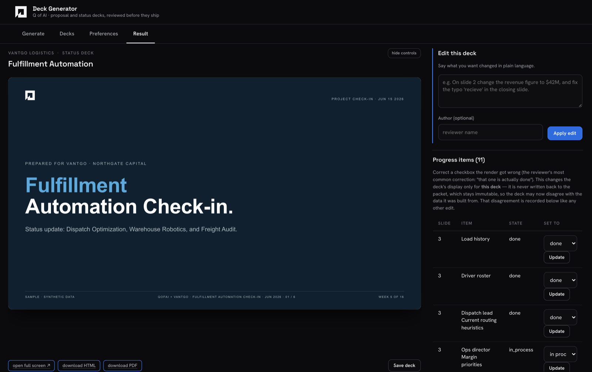
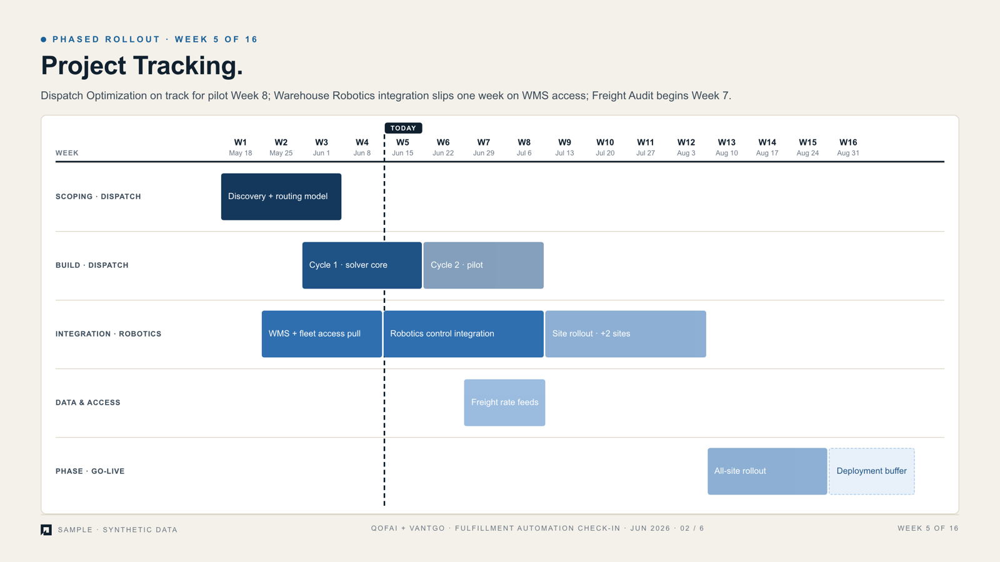
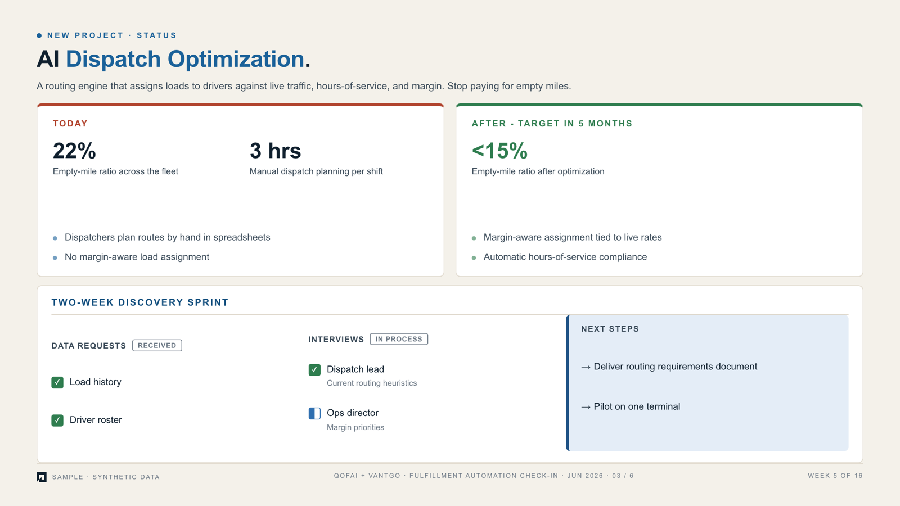

# qofai-deck-generator

Built during my internship at QofAI, which builds AI agents for middle-market private equity
firms and their portfolio companies. This agent writes the client-facing decks QofAI brings
to an engagement: a proposal deck before a project starts, and a status check-in deck while
it runs. A person reviews every deck before it goes anywhere. The agent never sends anything.

This is a sanitized copy. Client names, people, deal figures and every file built from a
real engagement are replaced or left out. See "What was changed for publication" below.



| Project tracking slide | Workstream slide |
|---|---|
|  |  |

Every screenshot comes from a synthetic client (Vantgo Logistics). The decks are real
pipeline output; the data behind them is invented.

## What it does

A reviewer picks a client and a project, or uploads the project's PRD, and the agent:

1. Loads the slide structure for the deck type from a template spec
   (`templates/proposal-template.md`, `templates/status-template.md`). Each slide declares typed
   content roles, who is expected to fill them (a source, a reviewer, or a reviewer only, for
   sensitive commercial figures), and which roles repeat per opportunity or per workstream.
2. Requests the project's data from the company's internal platform over MCP
   (`src/qofai_mcp_client.py`, `src/live_proposal_provider.py`), or reads it from an uploaded PDF or
   Word document (`src/document_text.py`, `src/prd_section_parsers.py`). Research papers are
   parsed for baselines, scenario tables, timelines and assumption tables, each with its own
   parser and fixture set.
3. Assembles a data packet and maps it onto the slide roles (`src/packet_assembly.py`,
   `src/data_source_adapter.py`). A completeness score gates the run per opportunity: a thin
   source is marked and the deck still renders, and the run is refused only when nothing clears.
4. Builds one labeled prompt section per slide, then renders an HTML deck through the Claude API
   (`src/prompt_assembler.py`, `src/deck_renderer.py`). The same content also comes out as a prompt
   for Claude Design, so a designer can work from it.
5. Runs the result through a stack of guards before a reviewer sees it.

Neither deck has a fixed slide count. A proposal repeats its opportunity, platform, plan and
next-steps slides once per opportunity. A status deck carries one slide per active workstream.

## The guards

Most of the code exists to make sure a deck never states something its sources did not.

- `coverage_guard.py` checks that every role the template needs either has a sourced value or
  carries a visible `[MISSING: ...]` marker. Nothing is filled with a plausible guess.
- `render_guard.py` checks that every marker and load-bearing value in the prompt survives
  into the rendered HTML.
- `text_gate.py` applies the house writing rules deterministically, then proves that no number,
  date, dollar figure, percentage or proper noun changed between input and output.
  `voice_pass.py` is a model-written tightening pass, and the same guard refuses any cut that
  would take a fact with it.
- `layout_guard.py` renders the deck in headless Chrome and flags clipped, overlapping or
  off-slide elements. `panel_fit.py` decides what a fixed-size panel can hold before render.
- `prd_loyalty_guard.py` keeps a PRD-sourced deck to what the PRD states.
- `commercial_blocks.py` rebuilds the commercial slide from source data after render, so a
  figure the model retyped cannot survive.
- `packet_consistency.py` refuses a packet that contradicts itself.

## The review studio

`ui/app.py` is a Flask app (hosted on Railway in production) where a reviewer generates,
reads and edits decks. It has tabs for generating, deck history, standing preferences and the
result. On the result tab a reviewer can switch individual bullets on and off, ask for an edit
in plain language (`src/html_edit_interpreter.py` turns it into exact swaps that
`src/html_edit_layer.py` applies, with revisions and undo), supply missing values, confirm or
send back flagged claims, and download the deck as HTML or as a PDF printed in headless
Chromium. Preferences a reviewer saves (`src/preference_store.py`) apply to later runs, but a
content rule always wins over a formatting preference.

Every model call is bounded by a timeout and a token ceiling, and a failed call says so on
the page instead of producing a silently thinner deck (`src/model_call.py`).

## Running it

```
pip install -r requirements.txt
python -m pytest                     # about 2,400 tests, no API key needed
export ANTHROPIC_API_KEY=...         # only for rendering a deck
python scripts/render_sample_deck.py                       # sample proposal
python scripts/render_sample_deck.py --deck-type status    # sample status check-in
python ui/app.py                     # the review studio on localhost
```

The PDF export test also needs `playwright install chromium`. The live data path needs
credentials for the company's internal platform, which are not part of this repo, so the
fixture packets stand in for it here.

`scripts/eval_status_decks.py` and `scripts/eval_negative_path.py` are re-runnable eval
harnesses: the first checks coverage, slide count and cross-client leakage across every status
packet, and the second proves that a packet missing required data escalates to a human and
writes no files at all.

## What was changed for publication

- Client, portfolio company, PE firm and person names are replaced with well-known fictional
  names (Northwind, Fabrikam, Contoso, Tailspin, Woodgrove) consistently across code, tests and
  fixtures, so the tests still pass. Ridgeline and Vantgo were synthetic in the original.
- Dollar figures that came from real engagements, and the commercial terms, are replaced with
  neutral values in every format they appear in.
- The two slide templates keep their real structure, with every example value rewritten for a
  fictional client.
- Left out: the planning documents (PRD, changelog, build plans, handoffs), meeting notes,
  generated decks and prompts, client documents, and the original README, which was a running
  build log.
